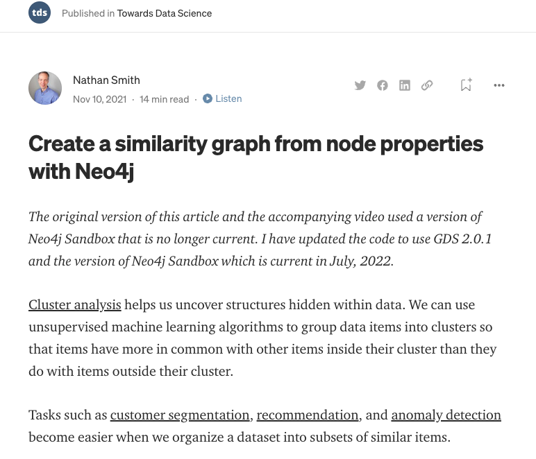
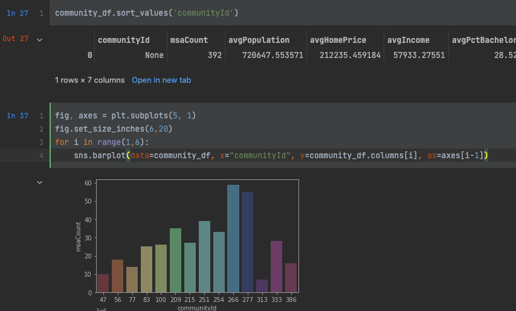

## MSA Similarity Python Examples

The examples in this folder were inspired by and originally drafted by Nathan Smith, in-house Data Scientist 

</img>

[Create a similarity graph from node properties with Neo4j](https://medium.com/towards-data-science/create-a-similarity-graph-from-node-properties-with-neo4j-2d26bb9d829e)

### Maintainer:

    anthony.krinsky@neo4j.com
    [https://github.com/drumcircle](https://github.com/drumcircle)

## Pre-Requisites

### Python
The Python examples in this directory do not require a Spark server.  

## Python graphics libraries

If they don't exist already in your python environment

    pip install graphdatascience
    pip install seaborn

When you run the workbooks, you will see output that includes:

### Spark 
Spark examples here have been written and tested on DataProc which supports Spark 2.x.
For the Spark examples, imports will need to be swapped when running on Spark 3.x.

### Neo4j
You will need a Neo4j server to run these examples.  
Neo4j [sandboxes](https://sandbox.neo4j.com) are a great learning resource and are large enough for these examples.

### Data

These examples refer to a dataset on Google Cloud Storage, BigQuery, or Snowflake as noted.

## Configuring Data Proc

Perhaps you have DataProc running already.  If not, follow these steps.

1. Configure GCloud client (if not done already)

2. Go to your GCP Console and create a new project (if not done already)

    <ul>
        <li>Enable billing for your Cloud Project
        <li>Enable Google Cloud Dataproc API
    </ul>

3. Create an auto-scaling policy 

Note: it is possible to run this lab without an autoscale policy, however, it is possible that resource constraints will frustrate completion, even with toy data.
At the end of the lab, you can simply delete the cluster to economize on resources.

First create an autoscale yaml file ([default-autoscale-policy.yaml](configuration/default-autoscale-policy.yaml)):

    workerConfig:
      minInstances: 2
      maxInstances: 10
      weight: 1
    secondaryWorkerConfig:
      minInstances: 0
      maxInstances: 100
      weight: 1
    basicAlgorithm:
      cooldownPeriod: 2m
      yarnConfig:
        scaleUpFactor: 0.05
        scaleDownFactor: 1.0
        scaleUpMinWorkerFraction: 0.0
        scaleDownMinWorkerFraction: 0.0
        gracefulDecommissionTimeout: 1h

Next from the command-line, import the configuration into google cloud ([create-autoscale.sh](configuration/create-autoscale.sh)):

    `gcloud dataproc autoscaling-policies import default-autoscale \
    --source=./default-autoscale-policy.yaml \
    --region=us-central1`

4. Create DataProc cluster
 
Select create a cluster from the Gcloud command-line be sure to edit first few arguments ([create-cluster](configuration/create-cluster.sh)):

    `gcloud dataproc clusters create neo4j-gcp-partners-dataproc  --project neo4jbusinessdev --autoscaling-policy default-autoscale --enable-component-gateway \
    --region us-central1 --zone us-central1-f --master-machine-type n1-standard-4 --master-boot-disk-size 500 --num-workers 2 \
    --worker-machine-type n1-standard-4 --worker-boot-disk-size 500 --image-version 1.5-ubuntu18 \
    --optional-components JUPYTER,ANACONDA`

Wait until the cluster status value is "Running" 

## Run Workbook

Explore contents as described in Nathan's blog.

[Create a similarity graph from node properties with Neo4j](https://medium.com/towards-data-science/create-a-similarity-graph-from-node-properties-with-neo4j-2d26bb9d829e)

## Developer Tips
Mostly everything you would expect "just works" when reading and writing to Neo4j from text files and datasources with DataProc.
These are a few twists and turns you may encounter along the way.

### BigQuery can be optimized
Non data scientists may assume that queries are written in SQL and that concerns are well separated.  
For example, queries are pushed down and incremental materializations and cacheing is done in the database.
This is not necessarily true with BigQuery.  There are options for reading tables in massive parallel and execution of free-form SQL
requires defining an intermediary table store.

### Data type casting
Sometimes data will come in as a type that Neo4j does not understand.

      https://neo4j.com/docs/spark/current/types/

There are three approaches to consider: cast at the source (SQL), cast in a dataframe, or cast in cypher (as we do with CSV examples).

Where possible, try to cast source decimal or double values as floats in the underlying database views or tables.

In the Snowflake example we learn how to cast using selectExpr in dataframes, requiring an intermediary materialization.

### Dataframes are not Pandas

Python visualizations libraries use Pandas which are not distributed like dataframes.  The procedures for converting pandas to dataframes are
straight-forward but important for newbies to understand.

### Not all queries are reads or writes
Neo4j queries like creating indicies, resetting the database, projections, or write-backs are neither strictly read nor write.  
Spark Connectors generally don't have straight-forward means for dealing with these queries.  For example, there is not <i>delete table</i> capability
for BigQuery.  With the Neo4j Spark Connector, we work around this issue with a side-effect action using the <i>script</i> option.

## Cleanup: stop or delete cluster

To economize resources, consider deleting the cluster after completion of the lab [delete-cluster.sh](configuration/delete-cluster.sh)):.

   `gcloud dataproc clusters delete neo4j-gcp-partners-dataproc  --project neo4jbusinessdev --region us-central1`

## Troubleshooting

Please feel free to create issues on the [source project github](https://github.com/neo4j-partners/gcp-api-examples)

